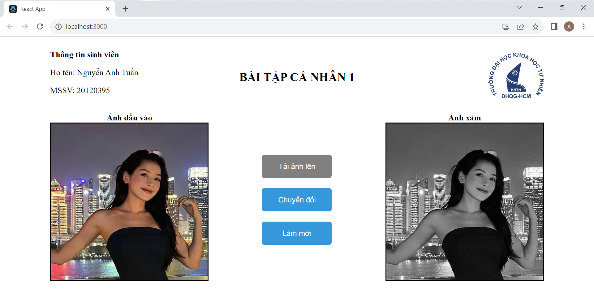

# BÀI TẬP CÁ NHÂN TUẦN 1

## Thông tin 
- Trường Đại học Khoa học Tự nhiên, TPHCM
- Lớp: Ứng dụng thị giác máy tính 20_23
- Họ tên SV: Nguyễn Anh Tuấn
- MSSV: 20120395

## Hướng dẫn cài đặt và chạy backend
- Bước 1: Cài đặt python
- Bước 2: Mở terminal với đường dẫn tại thư mục source
- Bước 3: Vào đường dẫn thư mục backend: cd backend
- Bước 4: Tạo môi trường ảo bằng lệnh: python -m venv py-env
- Bước 5: Kích hoạt môi trường ảo bằng lệnh: .\py-env\Scripts\activate
- Bước 6: Cài đặt cái thư viện cần thiết bằng lệnh: pip install -r requirements.txt
- Bước 7: Chạy backend bằng lệnh: python app.py

## Hướng dẫn cài đặt và chạy frontend
- Bước 1: Cài đặt nodejs
- Bước 2: Mở terminal mới tại đường dẫn thư mục source
- Bước 3: Vào đường dẫn thư mục frontend: cd frontend
- Bước 4: Cài đặt thư viện cần thiết bằng lệnh: npm install axios
- Bước 5: Chạy frontend bằng lệnh: npm start
- Bước 6: Trình duyệt sẽ tự động mở và hiển thị trang web. Nếu không thì có thể tự mở trình duyệt và nhập đường dẫn: http://localhost:3000/  

### LƯU Ý: Cần phải chạy cả backend và frontend.

## Hình ảnh trang web
